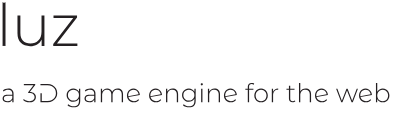
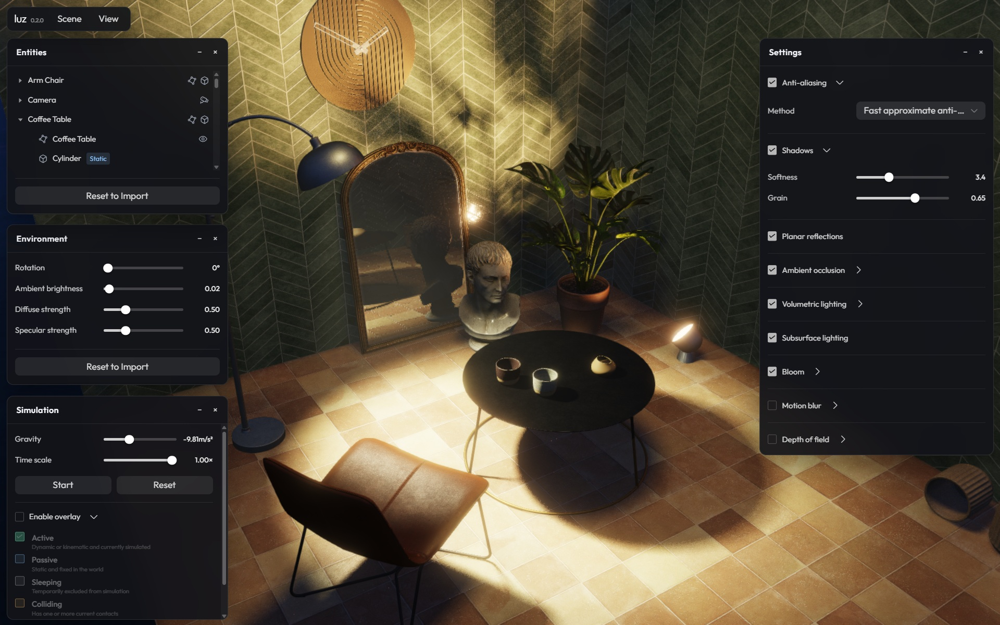

luz (pronounced [ˈluθ] or [ˈlus], Spanish for *light*) is a browser-native 3D engine built from scratch with TypeScript and WebGL 2.0. It combines a Blender-driven asset pipeline with physically based rendering, dynamic lighting, atmospheric and post-processing effects, visibility culling, and an integrated browser editor. 

Its rigid-body simulation supports static, dynamic, and kinematic bodies, multiple collider shapes, continuous collision detection, stable stacking, and moving platforms.

The engine has no run-time dependencies apart from WebGL 2.0.

