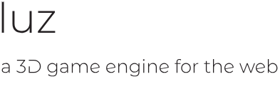
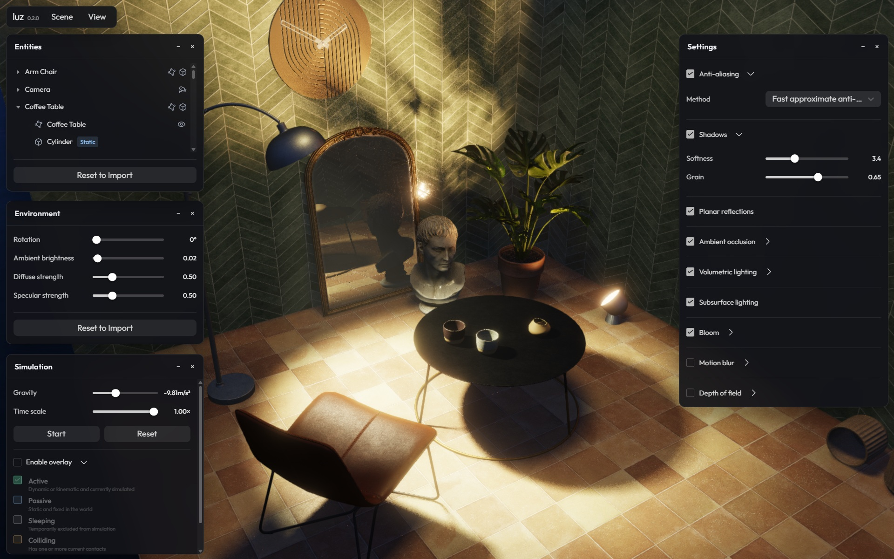

luz (pronounced [ˈluθ] or [ˈlus], Spanish for _light_) is a 3D game engine for the web, written from scratch in Typescript and WebGL 2.0.

It features dynamic lighting and shadows, visibility determination and hierarchical space partitioning, collision detection and response, and rigid-body simulation with continuous collision detection.



## Overview

The engine bundle includes its runtime dependencies, shaders and lookup textures.

Applications supply assets and their user interface. Optional [browser adapters](packages/browser/README.md)
provide image decoding and an animation loop. Custom decoders and scheduling are supported.

## Getting started

Use Node.js 24.8 or newer in the 24.x line (`.nvmrc`) and install dependencies from the repository root:

```sh
npm ci
npm run build:engine:production
```

The resulting `dist/` directory contains an ES module bundle (`index.mjs`), portable
TypeScript declarations, and a package entry point. Import the classes and helpers
you need with named imports, such as `import { Scene, Camera } from 'luz'`.

Browsers can resolve `luz` through an import map. Bundlers and Node.js use the package
exports. The `@luz/*` directories are internal workspace packages. Separate
npm package publishing is not (yet) supported.

## Editor

Use the editor app as the reference for building with the engine. Start with
its [application entry point](apps/editor/src/main.ts) and
[rendering lifecycle](apps/editor/src/runtime/editor-runtime.ts).
See [graphics services](packages/graphics/README.md) for rendering and resource lifetimes.

To run the editor:

```sh
npm --workspace @luz/editor run serve
```

Try the [live showcase](https://demo.luzjs.dev/) in a WebGL2-capable browser.

To run the self-contained showcase locally, run `npm run build:demo` followed by `npm run preview:demo`,
then open `http://127.0.0.1:4173/`. It includes two original scenes and the full editor.
See the [showcase guide](apps/editor/SHOWCASE.md) for controls and the
[deployment guide](apps/editor/DEPLOYMENT.md) for publishing from `main`.

For your own scenes, export into `apps/editor/public/assets/scenes/`
with dependencies under `apps/editor/public/assets/`. These local assets are excluded from the showcase build.

## Development checks

For the complete source checks, install Python, PowerShell 7 (`pwsh`), and `tar`,
then install the pinned Python formatter:

```sh
python -m pip install ruff==0.12.12
npm run check
```

This checks formatting, lint, source and test types, shaders, unit/integration tests,
builds, and the production distribution in an isolated consumer.

Browser GPU tests and generated Blender fixtures have a [separate guide](tests/browser/README.md).

## Blender extension

The [Blender extension](integrations/blender/README.md) exports scenes and reusable entities into the engine. Its guide covers installation and basic usage.

## License and attribution

The engine, editor, supporting project code, generated engine textures and logo are licensed under the [MIT License](LICENSE).

The Blender extension retains its [GPL-3.0-or-later license](integrations/blender/luz_exporter/LICENSE).

The engine textures are generated reproducibly by [repository tooling](tooling/textures/README.md).
Run `npm run validate:textures` to verify their contents.
